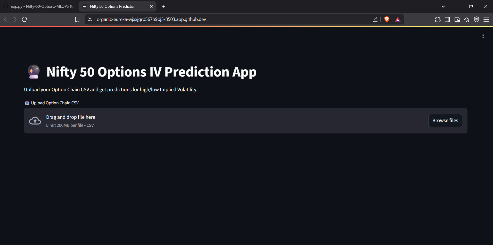

# Nifty 50 Options Trading MLOps Project

## Overview
This project predicts Nifty 50 option price movements using an MLOps pipeline, Streamlit, MLflow, Prefect, and GitHub Actions.

## Tech Stack
* Python 3.12

* Pandas, Scikit-learn, Seaborn

* Prefect for orchestration

* Streamlit for frontend

* MLflow for experiment tracking

* GitHub Actions for CI/CD

* Render for deployment

## Project Directory Structure
```bash
nifty50-options-mlops/
│
├── .github/workflows/
│   └── ci-cd.yml                  # GitHub Actions CI/CD pipeline
├── artifacts/                     # Store intermediate data/models
├── data/                          # Raw and processed data
├── notebooks/
│   └── eda_visualization.ipynb    # EDA & Data Viz
├── pipeline/
│   ├── data_ingestion.py
│   ├── feature_engineering.py
│   ├── model_training.py
│   └── prediction.py
├── prefect_flows/
│   └── option_pipeline.py         # Prefect Flow Orchestration
├── streamlit_app/
│   └── app.py                     # Streamlit Interface
├── docker/
│   └── Dockerfile
├── requirements.txt
├── .env
├── mlflow_tracking.py
├── README.md
└── main.py

```
#### Code pipeline structure has been implemented using Prefect, which orchestrates the entire workflow from data ingestion to model training and prediction.

## Features
- 📥 Data Ingestion via Prefect
- 🧪 Feature Engineering & Model Training
- 🧠 Model Logging via MLflow
- 📊 Visualization using Streamlit
- 🔁 CI/CD using GitHub Actions

## How to Run Locally

1️⃣ Clone the repository
```bash
git clone https://github.com/your-username/nifty50-options-mlops.git
cd nifty50-options-mlops
```
2️⃣ Install dependencies
```bash
pip install -r requirements.txt
```
3️⃣ (Optional) Setup Environment Variables
```bash
cp .env.example .env
```
4️⃣ Run full MLOps pipeline
```bash
python main.py
```
This runs:

* Data ingestion

* Feature engineering

* Model training + saving

* Prediction on new data

5️⃣ Launch Streamlit app
```bash
streamlit run streamlit_app/app.py
```
Upload "option_chain.csv" and get predictions interactively.


## 🔁 Prefect Flow
To orchestrate pipeline using Prefect:

```bash
prefect deploy prefect_flows/option_pipeline.py
prefect agent start
```

## 🧪 MLflow Tracking
Run MLflow UI (optional):

```bash
mlflow ui
```
View at http://localhost:5000.

## 📦 Docker Build (Optional)
To build Docker image for deployment:

```bash
docker build -t nifty-options-app -f docker/Dockerfile .
docker run -p 8501:8501 nifty-options-app
```
## 🌐 Deployment on Render
1. Push code to GitHub
Ensure your project is pushed to a GitHub repository.

2. Create Render Web Service
Go to https://render.com

Click "New Web Service"

Connect your GitHub repo

Environment: Python

Build Command:

```bash
pip install -r requirements.txt
```
* Start Command:

```bash
streamlit run streamlit_app/app.py --server.port=10000 --server.enableCORS=false
```
* Port: 10000

* Free Plan: works for basic usage

3. Add environment variables (if needed)
If you use .env, add relevant values in Render's Environment tab.

4. Wait for build → visit live URL!

## 📄 Sample Command Summary
```bash
# Train pipeline
python main.py

# Start streamlit
python -m streamlit run streamlit_app/app.py

# Prefect agent
prefect agent start

# MLflow
mlflow ui

# Docker run
docker build -t nifty-options .
docker run -p 8501:8501 nifty-options
```
## 🧪 Sample Data
Download a sample option chain file here or upload your own.



